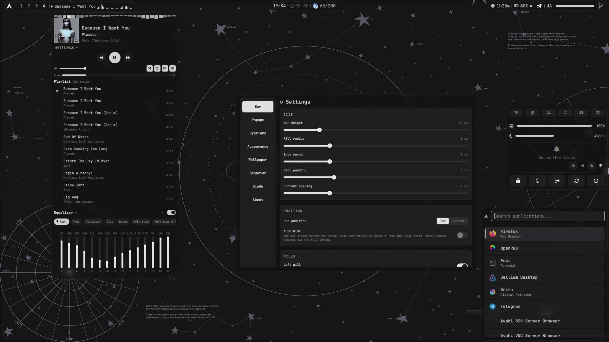
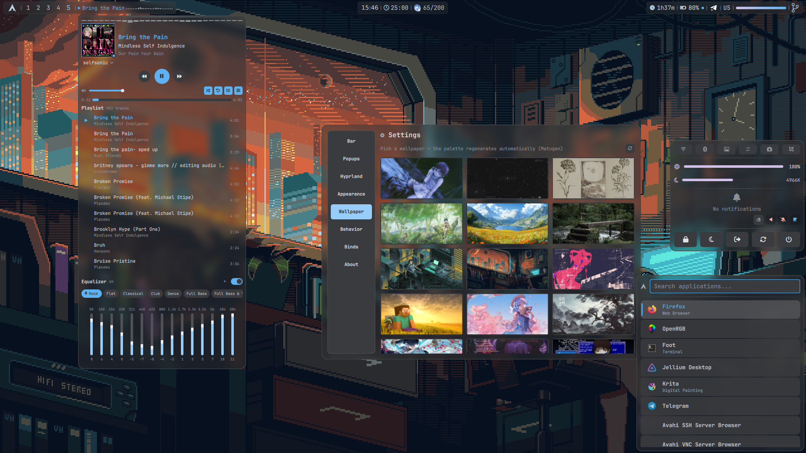

# SELFshell

A feature-complete Hyprland desktop shell built with **Quickshell**.
Includes a custom lock screen, a built-in idle manager, dynamic
wallpaper-based theming, and a fully configurable top bar — no external bar,
no separate lock/idle daemons.

<table>
  <tr>
    <td></td>
    <td></td>
  </tr>
</table>

## Features

**Shell & Bar**
- 16 built-in widgets across three configurable pill sections (left / center / right)
- Drag-and-drop widget reordering via a built-in Settings popup
- System Tray, MPRIS player with cava visualizer, Battery, Bluetooth, Network
- Time tracking (optional, requires [`selftrack`](https://github.com/TripShuti/SELFtrack) daemon): today's active time in the bar, centered popup with day/week/month summary, 00–24 timeline strip and per-app page breakdown (`qs ipc call selftrack toggle`)
- Settings popup: keybind rebinding and Hyprland window options (gaps,
  opacity, rounding, borders, dwindle/master layout) — applied live, no
  config file editing required

**Lock Screen & Idle**
- Native lock screen via `ext-session-lock-v1` with PAM authentication
- Keyboard layout badge next to the password field (left-click cycles layouts, right-click picks from the list)
- Brute-force protection — lockout after repeated failed attempts
- Built-in idle manager — lock → DPMS → suspend timeouts (replaces hypridle)
- Media playback pauses idle timers automatically

**Bluetooth**
- Secure pairing: every attempt shows a confirmation popup with the
  passkey (or PIN entry for legacy devices) — nothing pairs silently
- Per-device trust with a lock toggle in the Bluetooth manager
- Pairing mode: the adapter only accepts new pairings while Discoverable
  is on, and both flags drop together on timeout

**Phone — KDE Connect via [kcd](https://github.com/bethropolis/kcd)**
- Optional headless Go daemon [kcd](https://github.com/bethropolis/kcd) (`AUR kcd-bin`, `systemctl --user enable --now kcd`), LAN-only `1716/udp+tcp` `1739:1764/tcp`, no KDE stack, no telemetry
- Battery + reachable dot, Ping / Ring (FindMyPhone), Share file (`zenity`/`kdialog` → `kcd share`), Clipboard push (`kcd clipboard`), SFTP browse/mount/unmount (`kcd sftp` → `~/Downloads/kcd/mnt` ↔ `/storage/emulated/0`), notifications (`Phone • App` in toast + phone popup history, deduplicated, `kcdDndEnabled` — only popup when DND on)
- Phone popup: battery bar, Ping / Ring, Share file, Clipboard push, SFTP browse/mount/unmount, recent notifications + Clear, firewall hint. Pairing is phone-initiated only (Accept/Decline popup); terminal flow (`kcd pair`, `kcd connect`) unchanged. `kcdDndEnabled` toggle (header bell `F0F3`/`F1F6` + widget badge)
- MPRIS/media, volume and lock work via `kcd` plugins automatically (no extra UI)

**Dynamic Theming**
- Wallpaper-based palette generation via `matugen`
- Live reload — terminal (Kitty), prompt (Starship), file manager (Yazi) all update
- No restart required

**Hardware**
- Monitor brightness via `ddcutil` with coalesced writes (one transaction per drag)
- Blue-light filter via `hyprsunset` (3500K–6500K slider)
- Power actions: Shutdown, Reboot, Suspend, Logout, Lock

**Installer & CLI**
- `install.sh` — full setup from a fresh Arch install (greetd, services, cursor, AUR packages)
- `selfshell doctor` — runtime diagnostics (dependencies, services, hardware)
- `selfshell update`, `selfshell lock`, `selfshell reload` — all operations from CLI

<details>
<summary>Genshin Impact widget (optional)</summary>

- Real-time resin tracking with local regeneration calculation (1 resin / 8 min)
- HoYoLAB API sync for expeditions, dailies, teapot coins
- Auto-sync at high resin (≥198) and rate-limit protection
- Pulsing visual indicator at critical resin (≥190)
- Requires credentials in `scripts/.env` (see `.env.example`)
</details>

## Components

| Component | Role |
|-----------|------|
| [Hyprland](https://hyprland.org) | Wayland compositor (≥ 0.56.0 — supported Lua API) |
| [Quickshell](https://github.com/Quickshell/Quickshell) | QML-based shell/panel 
| [Kitty](https://sw.kovidgoyal.net/kitty/) | Terminal
| [Fish](https://fishshell.com) | Shell 
| [Starship](https://starship.rs) | Prompt 
| [Yazi](https://yazi-rs.github.io) | File manager 
| [Fastfetch](https://github.com/fastfetch-cli/fastfetch) | System info
| [kcd](https://github.com/bethropolis/kcd) | Headless KDE Connect daemon (phone, optional, AUR `kcd-bin`) |
| [selftrack](https://github.com/TripShuti/SELFtrack) | Focus-based time tracker (time tracking widget, optional, `cargo install --git`) |

## Quick start for fresh installed Arch
The installer targets Arch Linux. Back up an existing desktop configuration before replacing it. Installer failure paths are tested with isolated system-command stubs; hardware setup still depends on your machine.

```sh
git clone https://github.com/TripShuti/SELFshell
cd SELFshell
./install.sh
# follow the prompts, then reboot
```

The script installs dependencies, copies configs and optionally sets up
**greetd + tuigreet** for an **uwsm** session. It enables greetd for the next
boot without stopping the current display manager. If declined, start the
session from a TTY with `uwsm start hyprland.desktop`; Fish login autostart
is added only when a Fish config exists, and does not change your login shell.
Dotfiles are optional: installing only Quickshell does not configure Hyprland
startup. The final `selfshell doctor --preboot` checks dependencies and the
installed compositor version before services are enabled.

### Manual setup (without install.sh)

For a fresh configuration directory, clone and copy the component dirs into `~/.config/` (each repo subdir maps
to `~/.config/<name>`, mirroring what `install.sh` copies):

```sh
git clone https://github.com/TripShuti/SELFshell
mkdir -p ~/.config
cp -r SELFshell/{quickshell,hypr,fish,kitty,starship,yazi,fastfetch} ~/.config/
python3 SELFshell/quickshell/scripts/update_config.py record SELFshell ~/.config/quickshell quickshell hypr fish kitty starship yazi fastfetch
```

Then:
- Copy `quickshell/scripts/.env.example` to `.env` and fill in your credentials (if using Genshin widgets).
- Place your wallpapers in `quickshell/wp/`.
- Review and adjust path references in configs.
- Lock-screen frame `current-lock.jpg` and `current.*` are generated on every wallpaper switch; the tracked defaults are `wp1.jpg` and `black.png`.
- Ensure all dependencies listed in `install.sh` (`PACMAN_DEPS`) are installed.

## Updating an existing setup

Use `selfshell update` for an installed copy. It downloads `main`, prepares
and validates a separate tree, preserves settings/secrets/wallpapers and
updates the components recorded by the installer. Previously owned files
removed upstream are removed; conflicting edits to managed source files
stop the update. Backups remain until the new shell answers IPC. Failure
rolls files back and restarts the previous shell. Updates/reloads are
serialized and require an unlocked screen with no wallpaper apply running.

The installation manifest is `~/.config/quickshell/.selfshell-install.json`.
Older installs without it update Quickshell only; optional component
ownership and palette integration must be recorded explicitly. Keep the Git
checkout outside `~/.config`: the repository contains several component
directories and is not itself a runnable Quickshell configuration. Source
checkouts are updated with Git and reviewed before installation.

To register additional components in an existing installation, first merge
their managed source files with the checkout, then run:

```sh
python3 quickshell/scripts/update_config.py adopt . ~/.config/quickshell hypr fish kitty starship yazi fastfetch
```

Adoption refuses missing or differing managed files and preserves palette opt-in.
Hyprland `local.lua` (loaded after the shared modules), its JSON overrides,
and Yazi `yazi.toml`/`keymap.toml` remain personal across updates.

Re-running `./install.sh` is a replacement with backups, not a settings-preserving
update. Existing Quickshell configs require confirmation (default **no**);
declining exits before package or service changes. `--yes` accepts every
optional step; `--no` prints a plan and exits without changing anything.
On failure the installer restores backed-up files and removes fresh targets.
Package installations and external system settings are not rolled back.

Palette integration is enabled for the optional configs selected at install.
For a manually managed application, opt in explicitly, for example:

```sh
selfshell palette enable yazi
selfshell palette enable kitty
selfshell wallpaper reload
```

Available integrations: `kitty`, `fish`, `starship`, `yazi`, `foot`, `qt6ct`.
`palette disable <app>` stops subsequent writes. Enabling Yazi delegates its
`theme.toml` and generated `palette` flavor to SELFshell; back up custom themes.
`palette reload` only rereads `palette.json`; it does not regenerate app themes
or lock-screen frames. Use `wallpaper reload` or `theme set black` to regenerate.
`wallpaper current` returns the desktop image, including GIF; the lock screen
uses a separate generated static frame.

## CLI

`install.sh` installs a `selfshell` CLI into `~/.local/bin`:

```sh
selfshell doctor         # check dependencies, config, services, hardware
selfshell doctor --preboot # same, but skip session checks (for installer)
selfshell lock           # lock the screen
selfshell toggle-lock    # lock the screen (lock-only alias, no-op if already locked)
selfshell launcher       # toggle application launcher
selfshell settings       # toggle bar settings popup
selfshell control        # toggle control center
selfshell clipboard      # toggle clipboard history
selfshell kcd            # toggle phone (kcd) popup
selfshell audio          # toggle audio mixer
selfshell osd <volume|brightness> # show OSD overlay
selfshell theme [list|status|set <black|matugen>] # manage theme
selfshell wallpaper <list|current|set <file>|random> # manage wallpapers
selfshell palette <reload|show|path|enable|disable> # palette operations
selfshell config <get|set|edit|reset> <key> [value] # manage config.json
selfshell ipc [call] <target> <function> [args...]
selfshell reload         # restart quickshell
selfshell update         # staged update of managed components, with rollback
selfshell version        # show version
selfshell list           # list running quickshell instances
selfshell status         # quick status summary
selfshell services       # list services
```

## Dependencies

All runtime dependencies are handled by `install.sh`. See the `PACMAN_DEPS`
array in the script for the complete list. Key packages:

| Package | Purpose |
|---|---|
| `hyprland quickshell` | Compositor & shell |
| `kitty fish starship yazi` | Terminal, shell, prompt, file manager |
| `networkmanager bluez bluez-utils` | Network & Bluetooth |
| `pipewire wireplumber pipewire-pulse` | Audio |
| `hyprsunset` | Blue-light filter |
| `matugen awww` | Color generation & wallpaper |
| `breeze-cursors` (extra) | KDE Breeze cursor theme (XCURSOR_THEME + gsettings + index.theme) |
| `grim slurp wl-clipboard` | Screenshots & clipboard |
| `ddcutil` | Monitor brightness control |
| `upower` | Battery widget |
| `power-profiles-daemon` | Power profiles (Settings → System, auto power-saver) |
| `qt6-5compat` | `Qt5Compat.GraphicalEffects` — lock screen blur (required, shell won't start without it) |
| `greetd greetd-tuigreet` | TUI login screen (starts Hyprland via uwsm) |
| `uwsm` | User session manager (session start from greetd / fallback autostart) |
| `python-requests python-dotenv` | Genshin Impact widget (Hoyolab API) |
| `kcd` ([kcd](https://github.com/bethropolis/kcd), AUR `kcd-bin`) | Phone — KDE Connect without KDE stack (optional, `systemctl --user enable --now kcd`, `sshfs` for SFTP, `zenity`/`kdialog` for Share) |
| `selftrack` ([SELFtrack](https://github.com/TripShuti/SELFtrack), cargo) | Time tracking widget (optional, `systemctl --user enable --now selftrack-daemon`; the shell uses only `daemon` + `export`, the TUI is a standalone fallback) |

## Structure

``` 
docs/        - documentation (architecture, components, config formats)
fastfetch/   - system info config
fish/        - shell config, functions, yt-dlp wrapper
hypr/        - Hyprland (lua module system, env.json for user settings) & hyprsunset configs
install.sh   - automated setup script
kitty/       - terminal config
quickshell/  - QML panels, core, popups, widgets, monitors, scripts, data, assets, services
             - core/ — shell infrastructure (AppConfig, IdleManager, LockSurface/LockContext, AnimatedPopup, HoverItem/HoverButton, etc.)
             - monitors/ — background data monitors (Cava, Genshin, SelfTrack)
             - widgets/ — panel widgets (16 total, incl. KdeConnectWidget)
             - popups/ — popup windows (21 total, incl. KdeConnectPopup + settings/audio/mpris/control sections) + shared blocks (HoverButton, WallpaperController, PactlJsonProc, ResolvedIcon, EmptyHint)
             - scripts/ — helper scripts (palette, Genshin, AudioMixerUtils, Format.js, etc.)
             - data/ — persisted state (config.json, calendar-tasks, eq.json, etc.)
             - assets/ — icons, sounds
             - services/ — pairing agent, TrackListService, PacmanService, PowerProfileService, KdeConnectService, cava config
             - pam/password.conf — PAM config for lock screen auth
starship/    - prompt config
yazi/        - file manager config, keybindings, themes
```

## Notes

> **Disclaimer:** Bugs or breakage may occur on your machine. Feel free to use anything you like, but at your own risk.

- `hypr/env.json` — user-level Hyprland settings: terminal/browser/cursor, autostart apps, input devices. If the file is missing, built-in defaults (identical values) are used.
- `~/.config/hypr/binds.json` and `~/.config/hypr/visual.json` — keybinding and visual overrides written by the Settings popup (see [docs/CONFIG_FORMAT.md](docs/CONFIG_FORMAT.md)). Both files are optional; deleting them restores the built-in defaults.
- Genshin Impact widgets require Hoyolab API credentials (see `quickshell/scripts/.env.example`).
- Bluetooth pairing agent (`qs-bt-agent`) runs as a systemd user service and implements secure pairing: every new device must be confirmed in a popup, and trusted devices are managed in the Bluetooth manager.
